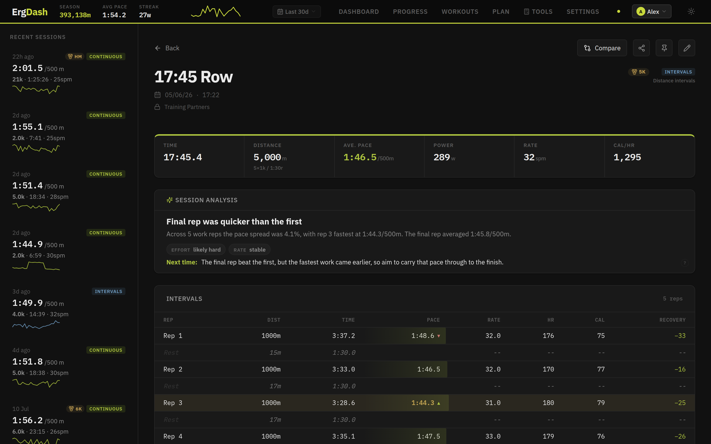
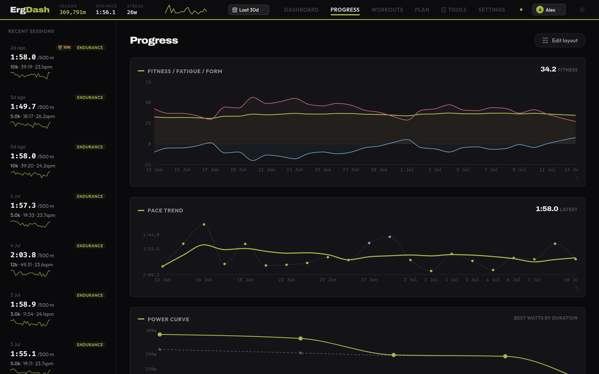

# ErgDash

A self-hosted dashboard for your Concept2 rower.

[](https://github.com/benjouk/ergdash/actions/workflows/ci.yml)
[](https://github.com/benjouk/ergdash/pkgs/container/ergdash)
[](LICENSE)

ErgDash connects to the Concept2 Logbook API to sync your workout history and display training analytics: volume trends, pace tracking, personal bests, and fitness modelling. Build and track training plans: schedule sessions on a calendar or start a ready-made multi-week program like [The Pete Plan](https://thepeteplan.wordpress.com/the-pete-plan/), with adherence tracked automatically against your synced workouts. Try the [live demo](https://ergdash.com/demo/), loaded with a season of sample data.


| Session detail | Progress |
|---|---|
|  |  |

## Features

- **Dashboard:** Season metres and streak stats, volume vs goal, session mix, personal bests with new-PB notifications, and a calendar heatmap
- **Profiles (household):** Connect several Concept2 Logbook accounts to one instance, with one profile per household member, each with its own workouts, PBs, goals, plans, and settings. Switch profiles from the header; rename, reconnect, disconnect, or remove members in Settings. Existing single-user installs upgrade in place
- **Session Detail:** Per-stroke pace and rate/HR charts, interval rep chart with HR recovery and a structure summary (e.g. 6×500m / 1:30r), rate-vs-pace scatter, HR zone bar, splits table, smart side-by-side comparison with ranked equivalent workouts and pacing diagnostics, downloadable session card, computed metrics (fade index, consistency, effort, distance per stroke, watts/beat, HR drift, rate discipline)
- **Workouts:** Filterable/sortable table with CSV/JSON export
- **Manual entry & file import:** Add rows that never reached the Logbook (old PM3/PM4 pieces, club machines, races) by hand, including work/rest splits, or import CSV (Concept2 Logbook export or generic), TCX, and FIT (PM5 USB / ErgData) files with a preview step, duplicate detection against synced workouts, and enrich-merge that fills in missing HR/drag/splits/stroke data
- **Result correction:** Edit distance/time/HR/drag/rate on any workout; corrections to synced workouts are tracked per-field, survive future syncs, and can be reverted to the Concept2 values at any time. Manual and imported workouts can be deleted
- **Session tags:** One-tap purpose tag on any session (warm-up / steady / test / race). Warm-up pieces logged as their own workouts keep counting toward volume, streaks, and fitness load, but drop out of pace and technique trends, the session mix, personal bests, and race projections - so a pre-5k paddle can't pollute your analytics
- **Goals & Targets:** Weekly/monthly/season/annual volume goals overlaid on the dashboard, plus performance targets per benchmark distance compared against current PBs and trend-based race predictions, with an optional race-day countdown
- **Race Plan:** A performance target with a race date gets a Progress card that counts back from race day - base/sharpen/taper phases on a timeline, countdown milestones (last all-out test, taper start, race-pace rehearsal, rest) - and projects the trend of your recent test pieces to a race-day time with an on-track / close / at-risk verdict and the required improvement per week
- **Ranking percentiles:** Set sex (plus optional birth year and body weight) in Settings and each personal best shows your standing in the ranked erg population for your age band and weight class (e.g. `top 18% - M 30-39 Hwt`). The server reconciles each needed bucket against the public Concept2 season rankings once a week (a handful of throttled page fetches of the most recent completed season, cached in SQLite); until a bucket has been reconciled - or if the instance is offline - percentiles fall back to a bundled estimate and are marked with a `~`. Set `ERGDASH_RANKINGS_LIVE=0` to disable the outbound rankings fetches, and use `node scripts/fetch-rankings.mjs d2000 M 30-39 hwt` to check the fetcher against the live site
- **Plan:** Month calendar to schedule future sessions (type, target distance/duration, pace, rate, notes) with interval structure (e.g. 4×2000m / 5:00r), common-session presets, and weekly repeat; synced workouts auto-match same-day plans with manual link/unlink, missed days are flagged, and a Progress chart tracks plan adherence over time
- **Programs:** Start a ready-made multi-week training program in one click, including **The Pete Plan**, Beginner Pete Plan, 2k Race Prep, and Marathon Build, which schedules every session for you; track a week-by-week completed/missed view, pause and resume, shift the whole schedule, or edit training days and future sessions remap automatically
- **Progress:** Coach-first Overview with a clear training verdict, four comparable signals, and the primary performance target; focused Training, Performance, and Technique views cover fitness/load, steady pace, zones, adherence, predictions, power-duration, PBs, fade, efficiency, stroke quality, HR drift, distance per stroke, and drag factor without putting every chart on screen at once
- **Tools:** Pace / watts / cal-per-hour converter, a Concept2 weight-adjusted score calculator, and a race plan builder with even, negative, and aggressive pacing strategies
- **HR Zones:** Five configurable zones in Settings (% of max HR), estimated from observed data until set
- **Body weight:** Optional setting that adds weight-adjusted equivalents to personal bests and Tools
- **Feed:** Always-visible sidebar of recent sessions with sparklines and interval summaries
- **Ticker:** Sticky header with key stats, pace trace, profile switcher, and navigation
- **Light/Dark theme:** System-aware with manual override
- **Units:** Toggle between /500m pace, watts, and cal/hr

## Setup

1. Register an OAuth app at [log.concept2.com/developers/keys](https://log.concept2.com/developers/keys) with these settings:
   - **Platform**: `Browser`
   - **Callback Endpoint**: `http://localhost:3100/auth/callback` (or your real host/port, which must match `C2_REDIRECT_URI` exactly)
   - The remaining fields (Website, Description, Webhook URL) are optional.
2. `cp .env.example .env` and fill in `C2_CLIENT_ID`, `C2_CLIENT_SECRET`, and `SESSION_SECRET` (`openssl rand -base64 32`).

> One OAuth app authorizes any number of Logbook accounts. Additional household members connect their own Concept2 account from inside the app (header → Add profile), with no extra credentials or configuration.
> If the ErgDash browser session expires, signing in through Concept2 is still
> allowed, but the Concept2 identity must match a profile already registered in
> the instance. Expired or revoked sync tokens therefore do not lock out the
> sole account.

ErgDash is intended for a trusted home LAN or an authenticated VPN such as
Tailscale/WireGuard. It deliberately supports ordinary HTTP on a LAN and does
not send HSTS or upgrade HTTP assets to HTTPS. Do not publish port 3100 directly
to the internet; use a VPN, or put the whole instance behind an access-control
layer you administer.

## Run (Docker)

Multi-arch images (`linux/amd64`, `linux/arm64`) are published to [`ghcr.io/benjouk/ergdash`](https://github.com/benjouk/ergdash/pkgs/container/ergdash). `latest` tracks `main`; releases are tagged `1.2.3` / `1.2`.

```yaml
services:
  ergdash:
    image: ghcr.io/benjouk/ergdash:latest
    ports:
      - "3100:3000"
    volumes:
      - ergdash-data:/data
    environment:
      C2_CLIENT_ID: your-client-id
      C2_CLIENT_SECRET: your-client-secret
      C2_REDIRECT_URI: http://localhost:3100/auth/callback
      SESSION_SECRET: your-session-secret
    restart: unless-stopped

volumes:
  ergdash-data:
```

The app is at `http://localhost:3100`. From a repo checkout, the included [docker-compose.yml](docker-compose.yml) reads the same settings from `.env`:

```bash
docker compose pull && docker compose up -d   # or build from source: docker compose up -d --build
```

Keep `SESSION_SECRET` stable for the life of the installation and alongside
your backups: it encrypts the stored Concept2 tokens as well as signing browser
sessions. Changing it logs browsers out and requires every profile to reconnect.

For an HTTPS reverse proxy, set both the public callback and canonical origin:

```dotenv
C2_REDIRECT_URI=https://ergdash.example.com/auth/callback
APP_ORIGIN=https://ergdash.example.com
```

`APP_ORIGIN` makes same-origin write checks work when TLS terminates at the
proxy. It does not force HTTPS and should be left empty for normal LAN HTTP.

### Moving to a reverse-proxy domain

If you set ErgDash up on a raw LAN address (e.g. `http://192.168.1.50:3100`)
and later put it behind a reverse proxy with its own hostname, expect to sign
in **once** on the new URL. The browser session lives in a cookie scoped to the
exact origin (scheme + host + port), so a cookie set on the LAN IP is never sent
to `https://ergdash.example.com` — a different origin gets its own session.

To make the new domain work and stick:

1. In your Concept2 app at
   [log.concept2.com/developers/keys](https://log.concept2.com/developers/keys),
   change the Callback Endpoint to `https://ergdash.example.com/auth/callback`.
   It must match `C2_REDIRECT_URI` exactly, so update both together.
2. Set `C2_REDIRECT_URI` and `APP_ORIGIN` to the new domain (as above) and
   restart. If the callback still points at the old address, the OAuth flow
   redirects back there and the session cookie never lands on the domain.
   `APP_ORIGIN` is required, not optional, once you are on HTTPS: it lets the
   same-origin write guard accept the proxied `https://` origin, otherwise
   saving settings, goals, and plans can 403 even after login succeeds.
3. Open the app on the new domain and connect once. On an already-initialized
   instance this is a login-only flow: your existing Concept2 identity is
   matched to your existing profile, so no data is lost and no duplicate profile
   is created.

Pick one canonical URL going forward — because the callback now points at the
domain, reaching the instance by its raw LAN IP will prompt for login again (and
its writes would fail the origin check unless that origin is also added to
`CORS_ORIGIN`).

## Environment Variables

| Variable | Default | Description |
|---|---|---|
| `C2_CLIENT_ID` | - | Concept2 OAuth client ID |
| `C2_CLIENT_SECRET` | - | Concept2 OAuth client secret |
| `C2_REDIRECT_URI` | `http://localhost:3100/auth/callback` | OAuth redirect URI |
| `C2_API_BASE` | `https://log.concept2.com` | Concept2 API base URL (only change for testing against a mock) |
| `PORT` | `3000` | Server listen port |
| `DATA_DIR` | `/data` (Docker) / `server/data` (local) | SQLite database directory |
| `SYNC_INTERVAL_MINUTES` | `15` | Auto-sync interval |
| `SESSION_SECRET` | - | Session signing secret (required in production, min 16 chars; generate with `openssl rand -base64 32`) |
| `COOKIE_SECURE` | auto | Force the session cookie's `Secure` flag on/off; auto-detects from `C2_REDIRECT_URI` |
| `APP_ORIGIN` | - | Canonical public origin for an HTTPS reverse proxy; leave empty for direct LAN HTTP |
| `CORS_ORIGIN` | disabled | Allow credentialed cross-origin API access from an explicit trusted origin. Production values must be `https://` and must not be `*`; not needed for normal same-origin setups |
| `BACKUP_ENABLED` | `1` | Default for nightly automatic database backups; set to `0` to disable. Settings → Automatic Backups overrides this |
| `BACKUP_KEEP` | `7` | Default for how many automatic backups to keep. Settings → Automatic Backups overrides this |
| `BACKUP_HOUR` | `3` | Default hour (0-23, server time) the nightly backup runs, at 30 minutes past. Settings → Automatic Backups overrides this |
| `ERGDASH_DEV_AUTH_BYPASS` | disabled | Set to `1` only for local development if you intentionally want API routes to bypass OAuth/session checks |
| `ERGDASH_SEED_DEMO` | disabled | Set to `1` on a non-production server to explicitly load mock workouts, goals, and plans |

## Automatic Backups

Every night (03:30 server time by default) ErgDash snapshots the whole
database to `DATA_DIR/backups/ergdash-auto-<date>.sqlite3`, keeping the
newest few and skipping nights where nothing changed. Snapshots are taken
with SQLite's online backup API, so they are safe while the app is running,
and each file is a plain database that Settings → Restore accepts directly.

Configure it in **Settings → Automatic Backups**: turn the schedule on or
off, pick the hour, choose how many snapshots to keep, and take a backup on
demand with **Back up now**. Changes apply immediately, no restart needed;
the `BACKUP_*` environment variables only provide the defaults for installs
that have never touched those settings. The authenticated `/health` payload
reports `last_backup` so you can verify it is running.

These backups live on the same disk as the database — they protect against
corruption, a bad upgrade, or an accidental wipe, **not** against the disk
itself dying. For that, copy `DATA_DIR/backups` somewhere else on a schedule
(rsync to a NAS, restic, a cloud sync client, ...), or download a copy from
Settings now and then.
