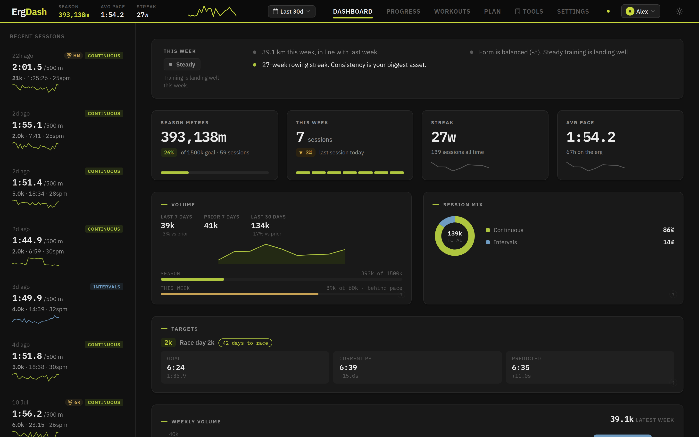

# ErgDash

A self-hosted dashboard for your Concept2 rower.

[](https://github.com/benjouk/ergdash/actions/workflows/ci.yml)
[](https://github.com/benjouk/ergdash/pkgs/container/ergdash)
[](LICENSE)

ErgDash connects to the Concept2 Logbook API to sync your workout history and display training analytics: volume trends, pace tracking, personal bests, and fitness modelling. Try the [live demo](https://ergdash.com/demo/), loaded with a season of sample data.



## Features

- **Dashboard:** Weekly coach summary, season metres and streak stats, volume vs goal, weekly volume chart, personal bests with new-PB notifications, calendar heatmap
- **Profiles (household):** Connect several Concept2 Logbook accounts to one instance, with one profile per household member, each with its own workouts, PBs, goals, plans, and settings. Switch profiles from the header; rename, reconnect, disconnect, or remove members in Settings. Existing single-user installs upgrade in place
- **Session Detail:** Per-stroke pace and rate/HR charts, interval rep chart with HR recovery, rate-vs-pace scatter, HR zone bar, splits table, side-by-side session comparison, downloadable session card, computed metrics (fade index, consistency, effort, distance per stroke, watts/beat, HR drift, rate discipline)
- **Workouts:** Filterable/sortable table with CSV/JSON export
- **Manual entry & file import:** Add rows that never reached the Logbook (old PM3/PM4 pieces, club machines, races) by hand, including work/rest splits, or import CSV (Concept2 Logbook export or generic), TCX, and FIT (PM5 USB / ErgData) files with a preview step, duplicate detection against synced workouts, and enrich-merge that fills in missing HR/drag/splits/stroke data
- **Result correction:** Edit distance/time/HR/drag/rate on any workout; corrections to synced workouts are tracked per-field, survive future syncs, and can be reverted to the Concept2 values at any time. Manual and imported workouts can be deleted
- **Goals & Targets:** Weekly/monthly/season/annual volume goals overlaid on the dashboard, plus performance targets per benchmark distance compared against current PBs and trend-based race predictions, with an optional race-day countdown
- **Plan:** Month calendar to schedule future sessions (type, target distance/duration, pace, rate, notes) with interval structure (e.g. 4×2000m / 5:00r), common-session presets, and weekly repeat; synced workouts auto-match same-day plans with manual link/unlink, missed days are flagged, and a Progress chart tracks plan adherence over time
- **Progress:** Fitness (CTL/ATL/TSB), pace trend, power-duration curve with 90-day ghost, time-in-zone and polarization stacks, efficiency (watts/beat), distance per stroke, stroke quality, HR drift, cumulative metres race line, drag factor timeline, PB progression, fade fingerprint, all in an editable layout
- **Tools:** Pace / watts / cal-per-hour converter, a Concept2 weight-adjusted score calculator, and a race plan builder with even, negative, and aggressive pacing strategies
- **HR Zones:** Five configurable zones in Settings (% of max HR), estimated from observed data until set
- **Body weight:** Optional setting that adds weight-adjusted equivalents to personal bests and Tools
- **Feed:** Always-visible sidebar of recent sessions with sparklines
- **Ticker:** Sticky header with key stats, pace trace, profile switcher, and navigation
- **Light/Dark theme:** System-aware with manual override
- **Units:** Toggle between /500m pace, watts, and cal/hr

## Setup

1. Register an OAuth app at [log.concept2.com/developers/keys](https://log.concept2.com/developers/keys) with these settings:
   - **Platform**: `Browser`
   - **Callback Endpoint**: `http://localhost:3100/auth/callback` (or your real host/port, which must match `C2_REDIRECT_URI` exactly)
   - The remaining fields (Website, Description, Webhook URL) are optional.
2. `cp .env.example .env` and fill in `C2_CLIENT_ID`, `C2_CLIENT_SECRET`, and `SESSION_SECRET` (`openssl rand -base64 32`).

> One OAuth app authorizes any number of Logbook accounts. Additional household members connect their own Concept2 account from inside the app (header → Add profile), with no extra credentials or configuration.

## Run (Docker)

Multi-arch images (`linux/amd64`, `linux/arm64`) are published to [`ghcr.io/benjouk/ergdash`](https://github.com/benjouk/ergdash/pkgs/container/ergdash). `latest` tracks `main`; releases are tagged `1.2.3` / `1.2`.

```yaml
services:
  ergdash:
    image: ghcr.io/benjouk/ergdash:latest
    ports:
      - "3100:3000"
    volumes:
      - ergdash-data:/data
    environment:
      C2_CLIENT_ID: your-client-id
      C2_CLIENT_SECRET: your-client-secret
      C2_REDIRECT_URI: http://localhost:3100/auth/callback
      SESSION_SECRET: your-session-secret
    restart: unless-stopped

volumes:
  ergdash-data:
```

The app is at `http://localhost:3100`. From a repo checkout, the included [docker-compose.yml](docker-compose.yml) reads the same settings from `.env`:

```bash
docker compose pull && docker compose up -d   # or build from source: docker compose up -d --build
```

## Environment Variables

| Variable | Default | Description |
|---|---|---|
| `C2_CLIENT_ID` | - | Concept2 OAuth client ID |
| `C2_CLIENT_SECRET` | - | Concept2 OAuth client secret |
| `C2_REDIRECT_URI` | `http://localhost:3100/auth/callback` | OAuth redirect URI |
| `C2_API_BASE` | `https://log.concept2.com` | Concept2 API base URL (only change for testing against a mock) |
| `PORT` | `3000` | Server listen port |
| `DATA_DIR` | `/data` (Docker) / `server/data` (local) | SQLite database directory |
| `SYNC_INTERVAL_MINUTES` | `15` | Auto-sync interval |
| `SESSION_SECRET` | - | Session signing secret (required in production, min 16 chars; generate with `openssl rand -base64 32`) |
| `COOKIE_SECURE` | auto | Force the session cookie's `Secure` flag on/off; auto-detects from `C2_REDIRECT_URI` |
| `APP_ORIGIN` | - | Optional canonical app origin used by production same-origin write checks when proxy headers do not match the public URL |
| `CORS_ORIGIN` | disabled | Allow credentialed cross-origin API access from an explicit trusted origin. Production values must be `https://` and must not be `*`; not needed for normal same-origin setups |
| `ERGDASH_DEV_AUTH_BYPASS` | disabled | Set to `1` only for local development if you intentionally want API routes to bypass OAuth/session checks |
| `ERGDASH_SEED_DEMO` | disabled | Set to `1` on a non-production server to explicitly load mock workouts, goals, and plans |
